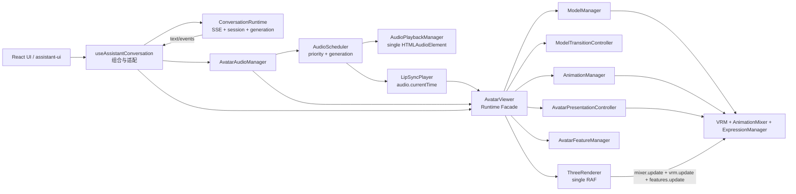
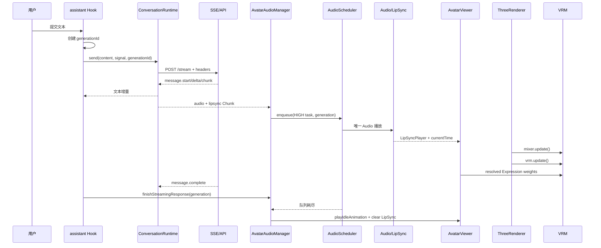
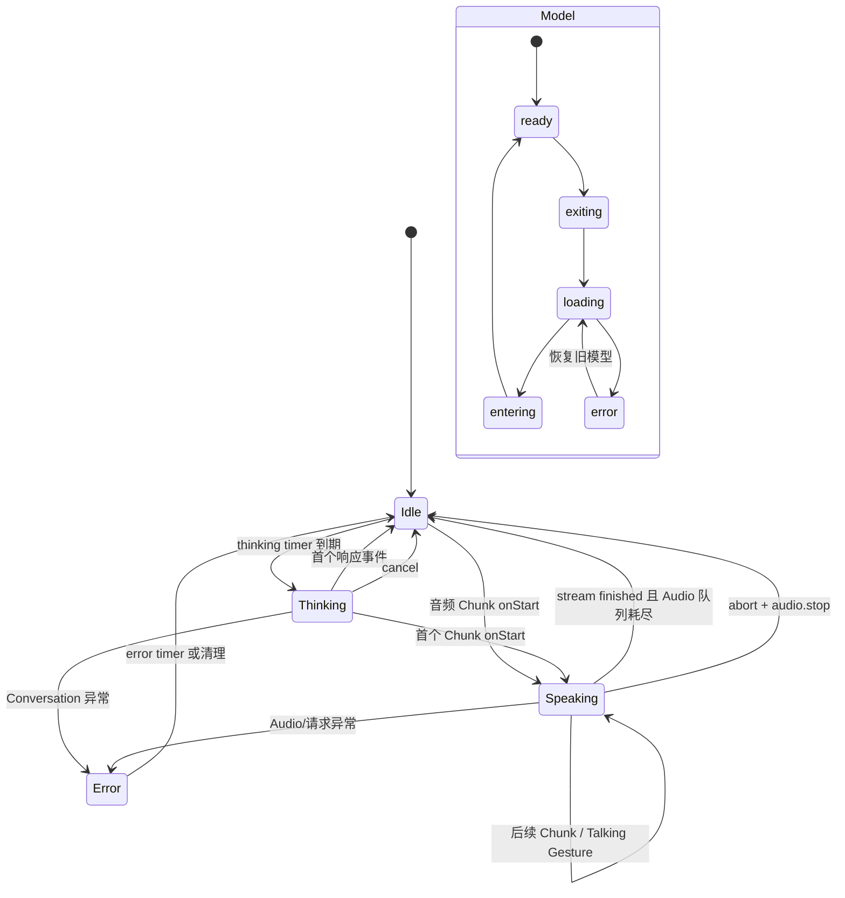
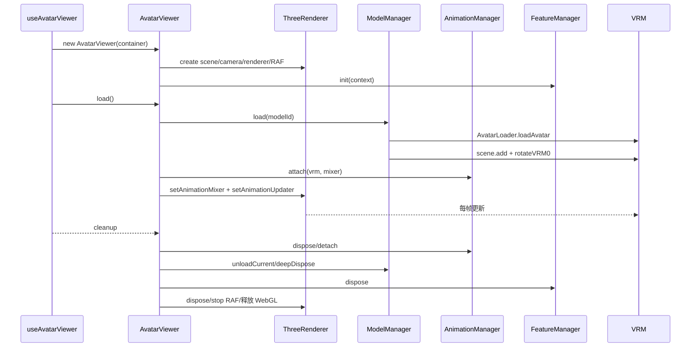
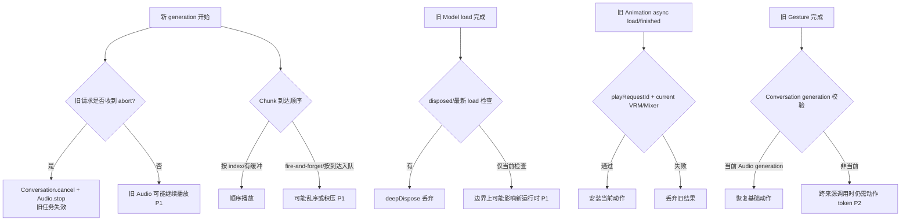

# Elara Avatar Runtime 架构决策评审

> 评审范围：当前 `/Users/panzhiying/Desktop/github/Elara` 源码；`UTSUWA_ELARA_ARCHITECTURE_RESEARCH.md` 只作为待复核的研究线索，不作为事实依据。本文未修改任何 Elara 源码、配置、依赖或 package 文件。

## 1. 研究报告复核

### 仍被当前源码证实的结论

- `AvatarViewer` 确实是运行时门面，内部组合 `ThreeRenderer`、`ModelManager`、`ModelTransitionController`、`AnimationManager`、`AvatarFeatureManager`、`AvatarExpressionFeature` 和 `LipSyncPlayer`。
- `ThreeRenderer` 确实拥有唯一 RAF；每帧依次执行 controls、mixer、Avatar 更新器、Feature 更新和 render。
- `AvatarPresentationController` 确实集中解析 Emotion、Blink、Mouth、LipSync、Micro Expression、Action Expression 后才写入 VRM Expression。
- `AudioScheduler`、`AudioPlaybackManager`、`LipSyncPlayer` 已形成单音频元素、优先级队列、generation 失效和音频时间轴驱动嘴型的基础。
- 模型切换控制器已实现 exiting → loading → entering → ready 的串行流程；动画播放有 `playRequestId` 防旧异步加载结果抢占。

### 已过时或需要修正的结论

1. 报告称“generation 已扩展到 Conversation、Audio、Lip Sync、Gesture、Emotion、Animation”。源码只在 Conversation、AudioTask/Interaction、LipSync 绑定和部分 Talking Gesture 入口使用 generation；`AnimationManager.play()`、`AvatarPresentationController` 和模型生命周期没有 generation 参数或统一校验。
2. 报告建议“应立即定义统一 `AvatarCommand / PresentationIntent`”。当前跨域接线只发生在 `useAssistantConversation`，且主要是 `viewer.playAnimation()`、`audio.enqueueStreamingChunk()` 和 Store 更新；尚无证据说明需要再加一层命令总线。更稳妥的决策是先稳定已有接口，只有出现第二个 Agent/第二个对话入口或可持久化表现事件时再引入窄接口。
3. 报告将 TTS 分句预取列为 P0，但当前前端收到的 SSE `message.chunk` 已携带独立音频和 LipSync，并立即入队；真正缺少的是乱序/背压策略，而不是复制 Utsuwa 的完整 VoiceOrchestrator。
4. 报告描述模型切换“处理并发限制”基本正确，但 `ModelManager.load()` 自身没有请求序号或 AbortSignal；它依赖上层 Transition Controller 的单并发，初始 `load()` 与外部切换并发仍需防护。

## 2. 当前真实架构

【源码事实】

文件：`src/avatar/AvatarViewer.ts`

符号：`AvatarViewer.constructor`、`loadModelRuntime`、`dispose`

行为：构造时创建 `ThreeRenderer`、`AvatarLoader`、`AnimationManager`、`ModelManager`、`ModelTransitionController`、`AvatarFeatureManager`、`AvatarEntranceFeature`、`AvatarExpressionFeature`，随后启动 `ThreeRenderer`。模型加载后创建 `THREE.AnimationMixer(vrm.scene)`，将 VRM/Mixer 绑定给 `AnimationManager`，将 `vrm.update`、LipSync 更新时间和 Feature 更新注册给 Renderer。

【架构推断】

真正的 Runtime Facade 是 `AvatarViewer`；下层对象不互相发现，而由 Viewer 注入协作回调。Three.js 场景、VRM、Mixer 的所有权分别集中在 Renderer、ModelManager/Viewer、Viewer/AnimationManager 协作中。

【源码事实】

文件：`src/hooks/useAvatarViewer.ts`、`src/hooks/useAssistantConversation.ts`、`src/app/App.tsx`

符号：`useAvatarViewer`、`useAssistantConversation`、`App`

行为：React Hook 创建和销毁 Viewer；另一个 Hook 用同一个 Viewer 创建 `AvatarAudioManager` 和 `ConversationRuntime`。App 只组合 AvatarStage、ConversationPanel、Camera 和模型选择 UI。

【架构决策】

继续以 `AvatarViewer` 作为 Avatar Runtime Facade；不另造第二个平行 Runtime 类。

## 3. 当前真实数据流

【源码事实】

文件：`src/hooks/useAssistantConversation.ts:78-89`、`src/runtime/conversation/ConversationRuntime.ts:54-155`

行为：用户文本由 assistant-ui adapter 提取，生成 `generationId`；`ConversationRuntime.send()` 通过 `ConversationService.streamMessage()` 建立 POST SSE。`message.delta`/`message.chunk` 产生文本增量；带 audio+lipsync 的 chunk 立即回调给 `AvatarAudioManager.enqueueStreamingChunk()`；`message.complete` 只结束文本流，随后 adapter 调用 `finishStreamingResponse()`。

【源码事实】

文件：`src/audio/AvatarAudioManager.ts:142-173`、`src/audio/AudioScheduler.ts:113-136`、`src/audio/AudioPlaybackManager.ts:17-69`

行为：每个 Chunk 被转成 HIGH `AudioTask`，进入单实例 `AudioScheduler`；Scheduler 只用一个 `HTMLAudioElement` 播放。任务 `onStart` 创建/激活 `LipSyncPlayer`，以 `audio.currentTime` 为外部时钟；队列和当前任务都耗尽且流已完成时，清空 LipSync、切回 Idle。

【源码事实】

文件：`src/avatar/AvatarViewer.ts:341-349`、`src/avatar/features/expression/AvatarPresentationController.ts:197-323`

行为：RAF 中先更新 Mixer，再调用 Viewer 的 animation updater；updater 调 `vrm.update(delta)`、按音频时间更新 LipSync 权重、再调用 FeatureManager。Expression Controller 在 Feature 更新中合成最终权重并调用 `VRMExpressionManager.setValue()`。

【架构判断】

真实链路为：

`用户输入 → assistant-ui adapter → ConversationRuntime → SSE → onChunk 文本/音频分流 → AvatarAudioManager → AudioScheduler → AudioPlaybackManager/HTMLAudioElement → LipSyncPlayer(audio.currentTime) → AvatarViewer → ThreeRenderer RAF → VRM/Mixer/Expression`。

## 4. 当前真实状态流

【源码事实】

文件：`src/runtime/conversation/ConversationRuntime.ts:60-73,157-177`

行为：发送时 Store 进入 `idle`；超时进入 `thinking` 并调用 `onThinkingStarted`；首个响应清除 Thinking 定时器并调用 `onResponseStarted`；异常进入 `error`，1.8 秒后回到 `idle`；取消时清空 generation 并重置状态。

【源码事实】

文件：`src/audio/AvatarAudioManager.ts:159-173,250-267`

行为：流式音频 Chunk 入队时 Store 进入 `speaking/playing`，Viewer 播放 Talking 基础动作；每达到随机句数阈值播放 `nodYes`；最后一项音频真正结束后恢复 Idle。

【源码事实】

文件：`src/avatar/managers/AnimationManager.ts:95-176,343-378`、`src/avatar/AvatarViewer.ts:385-404`

行为：动作播放以请求序号隔离异步 VRMA 加载；动作被替换时通知 `interrupted`，完成/异常时 Viewer 清理临时表达并恢复 `baseAnimationName`。

【架构判断】

Avatar Store 是可观察执行状态镜像，不是 Three.js 真正状态源；VRM、Mixer、Expression 权重、Audio 元素和 LipSync 当前状态分别由对应运行时对象拥有。

## 5. 当前真实生命周期

【源码事实】

文件：`src/hooks/useAvatarViewer.ts:28-61`

行为：React effect 创建 Viewer，调用 `viewer.load()`；cleanup 先解除 LipSync，再调用 `viewer.dispose()`。

【源码事实】

文件：`src/avatar/AvatarViewer.ts:406-422`、`src/avatar/managers/ModelManager.ts:112-135`

行为：Viewer dispose 标记 disposed、释放 AnimationManager、异步卸载模型、解除 Renderer mixer/updater、重置 LipSync、销毁 Features、Transition、ModelManager 和 ThreeRenderer。ModelManager 卸载前通过 `onBeforeUnload` 解除 Mixer、Expression Manager 和 VRM 引用，随后 `VRMUtils.deepDispose`。

【源码事实】

文件：`src/renderer/ThreeRenderer.ts:47-50,88-116`

行为：Renderer 自己拥有 RAF、ResizeObserver、OrbitControls、WebGLRenderer 和背景纹理；dispose 取消 RAF、断开 observer、释放 controls、场景几何/材质、纹理和 renderer。

【架构判断】

销毁方向清晰，资源释放责任基本单一；主要缺口是“dispose 后仍在途的 Transition/Model load 回调”需要更强的取消/代际保护。

## 6. 当前异步模型

【源码事实】

文件：`src/runtime/conversation/ConversationRuntime.ts:55-97`

行为：每次 send 递增序列并设置 `activeGeneration`；SSE 循环每项先检查 active generation；AbortSignal 传给 fetch；Thinking/Error timer 在响应、取消和错误路径清理。

【源码事实】

文件：`src/audio/AudioScheduler.ts:27-65,106-145`

行为：任务携带 generation；取消 generation 会标记失效、移除 pending、抢占当前可打断任务；高优先级任务可抢占低优先级任务；Scheduler 永远只有一个 current。

【源码事实】

文件：`src/avatar/managers/AnimationManager.ts:101-118,343-378`

行为：`playRequestId`、VRM/Mixer 引用比较和 `pendingPlayRequestId` 防止旧 VRMA 加载结果安装；finished 事件只接受当前 active Action。

【源码事实】

文件：`src/hooks/useAssistantConversation.ts:81-84`

行为：onChunk 中以 `void audio.enqueueStreamingChunk(...)` 发起入队，回调立即 `Promise.resolve()`；Conversation 不等待音频入队完成。

【架构推断】

当前系统是“Conversation 流式状态机 + Audio 单队列 + Avatar 单 RAF”的组合，而不是统一的事件总线或命令总线。其优点是简单、可追踪；其边界风险集中在跨层回调、流式 Chunk 乱序和取消时序。

### 异步竞态风险矩阵

| 风险 | 级别 | 当前状态 | 源码证据与判断 |
|---|---|---|---|
| 旧请求覆盖新请求文本/状态 | P1 | 部分解决 | `ConversationRuntime` 每次 SSE 事件检查 `activeGeneration`（`src/runtime/conversation/ConversationRuntime.ts:96-97`），但 Hook 同时启动多个 adapter run 时没有在“新 run 开始”统一取消前一 run；依赖 assistant-ui abort 语义。 |
| 旧音频继续播放 | P1 | 部分解决 | abort 路径调用 `audio.stop()`（`src/hooks/useAssistantConversation.ts:60-65`），Scheduler 支持 `cancelGeneration`（`src/audio/AudioScheduler.ts:53-62`）；非 abort 并行发送不会自动失效旧 response generation。 |
| 旧 LipSync 继续更新 | P1 | 部分解决 | LipSync 只在 Renderer updater 中按当前绑定 player 更新（`src/avatar/AvatarViewer.ts:344-347`），Audio 清理会 `setLipSyncPlayer(null)`；若旧音频未被取消，旧 player 会随旧 `audio.currentTime` 继续工作。 |
| 旧动画完成后错误恢复 Idle | P2 | 已解决（主路径） | `AnimationManager` 以 `activeAction` 过滤 finished，并以 `playRequestId` 过滤旧加载（`src/avatar/managers/AnimationManager.ts:101-118,343-378`）；Viewer 对 interrupted 不启动恢复 Idle（`src/avatar/AvatarViewer.ts:390-404`）。跨来源动作仍缺统一 token。 |
| 旧模型加载完成抢占新模型 | P1 | 部分解决 | `ModelManager` 在完成后检查 `disposed`，但没有 load token/AbortSignal（`src/avatar/managers/ModelManager.ts:88-110`）；Transition 只保证自身 activeTransition 单并发，不能覆盖外部初始 load 并发。 |
| 旧 Emotion 覆盖新 Emotion | P2 | 已解决（当前 API 范围） | Emotion 状态只在 `AvatarPresentationController` 内部合成，Expression 写入集中且无异步 Promise（`src/avatar/features/expression/AvatarPresentationController.ts:130-160,197-323`）；未来若 Agent 事件异步到达需带 generation。 |
| 旧 Gesture 在新 generation 执行 | P2 | 部分解决 | Talking Gesture 入口检查 `activeResponseGeneration`（`src/audio/AvatarAudioManager.ts:262-267`），取消路径停止动画（`src/hooks/useAssistantConversation.ts:60-65`）；独立 UI/Agent 同时调用 `viewer.playAnimation` 时没有 Conversation generation 约束。 |
| 旧回调修改已卸载 VRM | P1 | 部分解决 | Viewer updater 检查 `this.vrm !== vrm || disposed`，AnimationManager 也比较 VRM/Mixer；但 ModelManager/Transition 的在途 Promise 没有统一取消 token，需补 load generation。 |

结论：当前没有必须以 P0 方式重写的竞态；P1 集中处理旧音频、Chunk 顺序和模型加载代际，P2 再处理跨来源动作 token，P3 处理长期运行的轻量资源治理。

## 7. Avatar Runtime 边界

| 对象 | 创建者 | 持有/拥有的状态 | 生命周期 | Three/VRM 所有权 |
|---|---|---|---|---|
| `AvatarViewer` | `useAvatarViewer` | 当前 VRM/Mixer 引用、基础动作、LipSync 绑定 | React effect 期间 | 协调，不独占底层资源 |
| `ThreeRenderer` | `AvatarViewer` | Scene、Camera、Renderer、Controls、RAF | Viewer 构造至 dispose | Scene/Renderer/RAF |
| `ModelManager` | `AvatarViewer` | 当前 `LoadedAvatarModel`、模型状态 | Viewer 构造至 dispose | VRM 加载、挂载、deepDispose |
| `ModelTransitionController` | `AvatarViewer` | 切换状态、active Promise | Viewer 构造至 dispose | 不直接持有 VRM |
| `AnimationManager` | `AvatarViewer` | VRMA 缓存、Action、播放请求号 | Viewer 构造至 dispose | Mixer/Action 协作 |
| `AvatarFeatureManager` | `AvatarViewer` | Feature 列表和更新顺序 | Viewer 构造至 dispose | Feature 通过 context 访问 AvatarRoot |
| `AvatarPresentationController` | `AvatarExpressionFeature` | 情绪、眨眼、嘴型、LipSync 和解析权重 | 当前 Expression Manager 绑定期间 | 唯一集中写 Expression |
| `AvatarAudioManager` | `useAssistantConversation` | AudioScheduler、Interaction、response LipSync | Hook effect 期间 | 不拥有 VRM，只调用 Viewer 门面 |
| `AudioScheduler` | `AvatarAudioManager` | 单音频任务队列和 current | AudioManager 期间 | 不拥有 VRM |
| `LipSyncPlayer` | Audio/Hook | 时间轴与当前五个 viseme 权重 | 单任务期间 | 不拥有 Audio、Timer、RAF |

【架构决策】

保持以上边界。Conversation 不应向骨骼或 VRM 下指令；Audio 只通过 Viewer 的稳定表现 API 接入；ThreeRenderer 不接收业务事件。

## 8. 当前架构优点

【源码事实】

- `AvatarViewer` 通过回调把 Model、Animation、Expression、Renderer 解耦（`src/avatar/AvatarViewer.ts:89-140`）。
- `ModelTransitionController` 单并发复用 Promise，避免重复切换（`src/avatar/transition/ModelTransitionController.ts:67-82`）。
- `AnimationManager` 有缓存、请求号、旧 Action 延迟回收和生命周期事件（`src/avatar/managers/AnimationManager.ts:40-58,122-176,286-378`）。
- `AvatarPresentationController` 是唯一 Expression 写入点，且仅在权重变化时写入（`src/avatar/features/expression/AvatarPresentationController.ts:57-59,315-326`）。
- `LipSyncPlayer` 只消费外部时间，不拥有音频或 RAF（`src/lipsync/LipSyncPlayer.ts:13-58`）。
- `AudioPlaybackManager` 保障应用内唯一 `HTMLAudioElement`（`src/audio/AudioPlaybackManager.ts:7-69`）。
- `ThreeRenderer` 统一每帧顺序（`src/renderer/ThreeRenderer.ts:289-304`）。

【架构判断】

这些边界已经足够支撑单 Avatar、SSE、后端 TTS/LipSync、VRMA 和模型热切换；重写 Runtime 会放大风险而不会立即带来产品收益。

## 9. 当前真实问题

### P1：新一轮请求开始时没有立即淘汰旧音频 generation

【源码事实】`useAssistantConversation.ts:58-65` 设置新 generation，但只有 abort 回调调用 `audio.stop()`；普通并行 `run()` 若未先触发 abort，旧 AudioScheduler 任务不会因新 generation 自动取消。

【架构推断】如果上层产生并发发送或 adapter 取消语义不完整，旧音频可能继续播放；旧 LipSync 仍可能随旧 audio.currentTime 更新，直到被抢占。

【架构决策】P1 在 AudioManager 增加显式“开始新 response generation 时失效旧 response”入口；不改变 Viewer API。

### P1：流式 Chunk 入队是 fire-and-forget，未保证 index 顺序/背压

【源码事实】`useAssistantConversation.ts:81-84` 不等待 `enqueueStreamingChunk`；`AudioScheduler` 仅按入队时 `createdAt` 排序，流式路径没有像 `playChunkedResponse` 那样先按 `index` 排序。

【架构推断】后端 SSE 若乱序或网络调度造成回调先后变化，Chunk 播放顺序可能与 index 不同；大量 Chunk 还会无上限累积。

【架构决策】P1 在 AudioManager/流式适配层加入 index 缓冲、重复丢弃、有限窗口和 generation 校验；不复制完整 Utsuwa 编排器。

### P1：模型加载取消粒度不足

【源码事实】`ModelManager.load()` 在 await `loader.loadAvatar()` 期间没有请求 ID；`ModelTransitionController.dispose()` 只清理引用，不能取消已运行的 callbacks（`ModelManager.ts:88-110`、`ModelTransitionController.ts:85-90`）。

【架构推断】dispose 或新一轮加载发生时，旧 GLTF 仍可能完成；当前有 disposed 检查和 deepDispose，但缺少统一的“最新加载胜出”语义。

【架构决策】P1 给 ModelManager 增加内部 load generation/取消检查，并让 Transition 在 dispose 后忽略状态通知；保持现有 load/switch API。

### P2：动作代际没有与 Conversation generation 关联

【源码事实】`AnimationManager.play()` 只接受动画名和播放选项；Talking Gesture 在 `AvatarAudioManager.maybePlayTalkingGesture()` 中只检查当前 audio generation。

【架构推断】音频取消通常会调用 `viewer.stopAnimation()`，已有保护足够覆盖主路径；但跨来源同时调用 Viewer 时，旧 Gesture 的完成回调仍按 AnimationManager 当前动作语义处理。

【架构决策】暂不把 Conversation generation 硬塞进 AnimationManager；先通过 AudioManager 的取消/新 generation 边界解决真实竞态，后续有多 Agent/多来源动作时再引入动作 token。

### P2：Store 有部分“预留字段”没有真实写入者

【源码事实】`AvatarStoreState` 声明 `gesture`、`animation`、`currentTaskId`、`emotion`，但仓库搜索显示主要调用只更新 avatar/audio/lipsync/generation/conversationId。

【架构推断】Store 不是当前完整表现状态源；若直接把它扩展成第二个权威状态源，会造成 Viewer/Store 双写。

【架构决策】保留字段兼容性，暂不将其升级为 Command Bus 或完整 Redux 式状态机。

### P3：Scheduler 的 invalid generation 集合无界增长

【源码事实】`AudioScheduler.cancelGeneration()` 将 generation 永久加入 `invalidGenerations`，没有清理。

【架构推断】长时间会话中产生小量集合增长，但不是当前功能正确性的主要风险。

【架构决策】P3 以有界 generation/TTL 或轮次清理解决，避免为了微小收益提前重构。

## 10. Utsuwa 借鉴价值重新评估

| 设计 | Utsuwa 做法 | Elara 当前做法 | 谁更合理 | 是否借鉴 | 现在实施 |
|---|---|---|---|---|---|
| TTS Segment Prefetch | `VoiceOrchestrator.pushSegment()` 预取后续句并限并发 | SSE Chunk 携带音频，AudioScheduler 立即入队；无显式预取窗口 | Elara 边界更简单，Utsuwa 在高延迟 TTS 更强 | 借鉴有限窗口/背压 | P1，先做顺序缓冲，不做无限预取 |
| Streaming TTS | Provider 可边合成边排程 | 前端消费后端已生成的音频 Chunk | 取决于后端；当前 Elara 已是流式消费 | 借鉴 capability 字段 | P2 |
| Audio Pipeline | 分句、Semaphore、Abort、Analyser/AudioContext | 单 Audio 元素 + Scheduler + generation + LipSync 时间轴 | Elara 对当前产品更清晰 | 借鉴取消、并发和可观测性 | P1/P2 |
| Generation/Interrupt | session + AbortController + interrupt | Conversation activeGeneration、AudioTask generation、abort | Elara 已有清晰基础，但未统一至动作 | 借鉴“跨边界失效”原则 | P1 |
| Animation Scheduling | 组件 effect/动作状态 | AnimationManager 请求号、单 Mixer、恢复基础动作 | Elara 更可测试 | 只借鉴优先级/恢复语义 | P2 |
| Expression Scheduling | 多处组件/Store 直接写值 | PresentationController 统一解析 | Elara 明显更合理 | 不复制 Utsuwa 分散写法 | 现在保持 |
| Interaction Reaction | 区域策略→表情/骨骼脉冲 | 当前只有 Camera Action 与 Talking nod | Utsuwa 产品能力更丰富 | 未来新增 Reaction Feature | P2 |
| Camera/Physics | 相机反馈 Spring Bone、统一组件帧循环 | 统一 RAF，尚无 Physics/Gaze | 当前 Elara 简单合理 | 设计为可插拔 Feature | P3 |
| Avatar Capability | Store/组件依据 VRM 能力运行 | Expression Descriptor 已从真实绑定枚举 | Elara 已有正确起点 | 借鉴 Profile 思路 | P2 |
| Provider Capability | Provider 暴露 streaming/emotion 等能力 | API 类型固定 audio/lipsync/chunks | Utsuwa 更适合多 Provider | 建立最小 capability，不改现有 API | P2 |
| Local Avatar Persistence | localforage 保存 Blob/缩略图 | Registry/URL 加载 | 取决于用户上传需求 | 仅用户上传出现时借鉴 | P3 |
| Multi Avatar | 多 Store/窗口/角色状态 | 单 Viewer、单 VRM | 当前 Elara 更合理 | 保留 ModelManager 扩展点 | 不现在实施 |
| Overlay/Desktop Runtime | Tauri event、BroadcastChannel、多窗口 | Web React 单页面 | Utsuwa 设计不适用当前定位 | 产品进入桌面多窗口时再评估 | 不现在实施 |

## 11. Agent 接入边界

【源码事实】`ConversationRuntimeResult` 当前输出 `text`、原始 `response`、`generationId`、`requestId`；SSE 事件类型已有 message、audio、lipsync、error，但没有 emotion/motion/gesture 字段（`src/runtime/conversation/ConversationRuntime.ts:9-17`、`src/api/conversationStream.ts:1-34`）。

【架构推断】对 Pi Agent、LangGraph、自研 Agent、SSE Agent、WebSocket Agent 的共同稳定边界应先是“文本 + 可选已版本化的音频分片/时间轴 + generation 元数据”。自然语言仍是必选输出；表现信息只有在 Agent 已有可靠语义时才作为可选事件，不应让 Agent 直接依赖 Three.js 或 VRM 名称。

【架构决策】短期 Agent 输出：`text`/事件流，音频与 LipSync 仍由 Conversation/Audio 管线消费。中期若确实需要情绪/动作，新增窄的、可丢弃的 `presentation` 字段或事件，字段至少包含 `generationId`、`priority`、`emotion?`、`motion?`、`gesture?`、`interruptible?`、`duration?`；由适配层转换为现有 Viewer/Audio API。不要现在引入完整 SemanticEvent、EmotionResolver、GestureController 族谱。

## 12. Avatar Command / Presentation Intent 是否需要

【源码事实】当前唯一业务接线在 `useAssistantConversation`：ConversationRuntime 的两个回调驱动 thinking/response 动作；AudioManager 直接调用 Viewer 的 `playTalkingAnimation`、`playAnimation`、`playIdleAnimation`、`setLipSyncPlayer`。没有第二个 Agent、没有多消费者、没有命令持久化或回放需求。

【架构判断】现在新增完整 Avatar Command/Presentation Intent 层会把已有两条明确调用链改成第三种协议，增加映射和生命周期，却不能解决已识别的主要问题（Chunk 顺序、旧音频取消、模型加载代际）。

【架构决策】**NO（现在不新增完整层）**。先保持 `ConversationRuntime → Hook 组合层 → AvatarAudioManager/AvatarViewer`。当出现第二种 Agent、非对话事件来源、表现事件回放/日志、或动作/情绪/语音需要统一抢占策略时，再新增最小 `PresentationRequest`，仅作为边界 DTO，不让它直接携带 VRM 对象。

## 13. 关键架构决策

### 决策 1：AvatarViewer 是否继续作为核心 Runtime Facade？

**YES。** 它已经集中模型、Mixer、Features、Expression、LipSync 和 Renderer 的协作，且 React Hook 只依赖稳定门面 API。

### 决策 2：是否需要新增 Avatar Command / Presentation Intent？

**NO（现在）。** 当前只有一个对话入口和一个 Viewer；优先修真实竞态。未来多来源时引入最小 DTO。

### 决策 3：ConversationRuntime 是否应该直接知道 Avatar？

**NO。** 当前源码已通过 callbacks 和 Hook 组合隔开；ConversationRuntime 只处理 SSE、会话、generation 和 Store 镜像。继续保持。

### 决策 4：AudioScheduler 是否继续作为 Audio 与 Avatar 之间核心桥梁？

**YES。** 它拥有单 Audio 元素、优先级、取消、任务完成和时间读取，正好是音频/LipSync 的时序边界。应增强顺序缓冲和旧 generation 失效，而不是绕过它。

### 决策 5：Expression 是否继续统一经过 PresentationController？

**YES。** 这是当前最清晰、最可扩展的边界；禁止新增直接 `VRMExpressionManager.setValue` 的业务路径。

### 决策 6：是否需要新增独立 Gesture 层？

**暂不需要。** 当前 Talking Gesture 只有低频 `nodYes`，AnimationManager 已能播放并恢复基础动作。出现多手势优先级、打断、队列和语义动作后再拆。

### 决策 7：是否需要新增 Gaze Feature？

**后续。** 当前没有用户/摄像头目标输入；先不引入每帧骨骼覆盖。未来以 Feature 接入统一 RAF，并通过明确优先级避让动作。

### 决策 8：是否需要新增 Physics Feature？

**后续。** VRM 自带 `vrm.update()` 已运行，但没有相机反馈或自定义物理需求。需求出现时再增加，不改 Renderer 所有权。

### 决策 9：是否需要重新设计 Avatar Runtime？

**小幅演进。** 现有拆分已经是可维护 Runtime；只需补 generation/取消、流式顺序和加载代际，不做重写。

## 14. 推荐最终架构

当前推荐保持：

`React UI → useAssistantConversation（组合/适配） → ConversationRuntime（SSE/会话/generation）`

`React UI/Conversation 回调 → AvatarAudioManager → AudioScheduler → AudioPlaybackManager + LipSyncPlayer`

`AvatarAudioManager/React UI → AvatarViewer Facade → ModelManager + ModelTransitionController + AnimationManager + AvatarFeatureManager/ExpressionFeature → ThreeRenderer RAF → VRM/Mixer/Expression`

只新增两类横向能力：

1. Audio 流式 Chunk 的 index 缓冲/背压/旧 generation 失效。
2. Model load/transition 的取消和“最新请求胜出”保护。

未来需要 Agent 表现语义时，先在 Hook/适配层把可选 DTO 映射到现有 Viewer API；暂不让 Agent 依赖 Avatar 内部类。

## 15. Mermaid 总架构图

## 16. Mermaid 数据流图

## 17. Mermaid 状态流图

## 18. Mermaid 生命周期图

## 19. Mermaid 异步竞态图

## 20. P0

当前没有必须立刻重写的 P0 代码缺陷。P0 的工作是约束和验证：

1. **冻结边界契约**：继续禁止 ConversationRuntime 直接导入 AvatarViewer、VRM、Three.js；继续禁止业务代码绕过 PresentationController 写 Expression。原因：避免在真实问题尚未定位前扩大改造面。修改层：架构约束/代码评审。API：无。Viewer/Conversation/Audio/Renderer：无影响。复杂度低，风险低。
2. **增加竞态测试场景清单**：覆盖取消、旧 Chunk、模型切换、dispose 后回调、动作替换。修改层：测试/验证，不改变产品 API。复杂度低，风险低。

## 21. P1

1. **新 response generation 主动失效旧 response**：为什么做：避免旧 Audio/LipSync 残留；层：`AvatarAudioManager`/Hook；API：新增内部或窄 public 方法；AvatarViewer：不影响；ConversationRuntime：不直接影响；AudioScheduler：调用现有 `cancelGeneration`；ThreeRenderer：无影响；复杂度中；风险中。
2. **流式 Chunk index 缓冲、去重和有限背压**：为什么做：修正 fire-and-forget 和乱序风险；层：Hook→AudioManager 适配；API：可保持 `enqueueStreamingChunk` 兼容；AvatarViewer：无；ConversationRuntime：只需保持事件；AudioScheduler：继续作为播放桥梁；ThreeRenderer：无；复杂度中；风险中。
3. **ModelManager load generation/取消检查**：为什么做：防旧模型加载完成后影响新生命周期；层：ModelManager/Transition；API：可增可选 signal，不破坏现有调用；AvatarViewer：继续门面；ConversationRuntime/Audio：无；ThreeRenderer：无；复杂度中；风险中。
4. **统一 Audio 清理状态更新**：为什么做：确保取消、失败、自然结束都清 LipSync/Idle/Store；层：AvatarAudioManager；API：保持现有方法；Viewer：仅复用现有 playIdle/setLipSync；复杂度低-中；风险中。

## 22. P2

1. **最小 Provider capability**：为什么做：未来多 TTS/Agent 时选择 streaming、LipSync、prefetch 策略；层：Conversation/Audio API 类型；现有 API：新增可选字段；Viewer：无；复杂度中；风险低-中。
2. **Avatar capability profile**：为什么做：动作/表情/Gaze/Physics 需要按真实 VRM 能力降级；层：Model/Expression 描述；Viewer：可提供只读能力查询；Conversation/Audio：无；复杂度中；风险低。
3. **动作 token/优先级语义**：为什么做：只有当 Gesture、Emotion、Thinking、Camera Action 多来源竞争时才需要；层：AnimationManager/Viewer；API：可能新增播放选项；Viewer：扩展门面；复杂度中-高；风险中。
4. **调试快照和事件日志**：为什么做：定位 generation、音频任务、模型状态和动作恢复问题；层：各 Manager 只读诊断；对外 API：可选；复杂度中；风险低。

## 23. P3

1. **Gaze/HeadTracking Feature**：有真实目标输入后再做；不改变 Renderer 所有权；复杂度中；风险中。
2. **Physics/SpringBone 反馈 Feature**：需要相机角速度或服装物理需求后再做；复杂度中；风险中。
3. **Interaction Reaction Feature**：点击/触摸/语音反馈成为产品需求后再做；复杂度中；风险中。
4. **Local Avatar persistence / 多 Avatar 缓存**：出现用户上传、离线或多角色需求后再做；复杂度中-高；风险中。
5. **Scheduler invalid generation 有界清理**：解决长期会话的小量内存增长；层：AudioScheduler；API：无；复杂度低；风险低。
6. **Overlay/Desktop/跨窗口同步**：仅在产品进入 Tauri/多窗口阶段评估；当前不实施。

## 24. 当前不要做的事情

- 不要重写 `AvatarViewer` 或再造平行 `AvatarRuntime` 类。
- 不要现在引入完整 `AvatarCommand`、`PresentationIntent`、`SemanticEvent`、`EmotionResolver`、`GestureController` 体系。
- 不要让 `ConversationRuntime` 导入 AvatarViewer、VRM、Three.js。
- 不要让 Agent 直接输出 VRMA 文件名、骨骼节点或 ExpressionManager 调用。
- 不要复制 Utsuwa 巨型 `VrmModel.svelte` 或多处直接写 Expression 的模式。
- 不要用文本长度估算 Talking 时长覆盖真实音频生命周期。
- 不要把 `AvatarStore` 升级为第二个权威 VRM 状态源。
- 不要为了未来 WebSocket、Tauri、多 Avatar、关系/记忆业务提前引入大型抽象。
- 不要在没有真实目标输入前实现 Gaze、Physics、Camera Jiggle。
- 不要用无限 TTS 预取、无限 Chunk 队列或无上限并发替代现有 Scheduler。

## 25. 最小改造方案

1. 在新 response 开始处失效旧 response generation，并确保旧任务的 onCancel 只清理旧播放器。
2. 在流式适配层维护 `nextExpectedIndex`、有限 pending map 和重复 Chunk 丢弃；当窗口过大时按策略丢弃过期 Chunk，而不是无限排队。
3. 给 ModelManager 增加内部 load token；加载完成后必须同时满足“未 disposed、仍是最新 token、当前绑定未被替换”才挂载。
4. 保留 `AvatarViewer` 的现有 public 方法；必要时仅增加 `getCapabilities()` 或内部 generation-aware helper，不修改 `ConversationRuntime` 到 Avatar 的直接边界。
5. 为上述三条增加可注入播放器、假 Loader、假 Mixer/Clock 的单测；先验证取消与恢复，再考虑新抽象。

## 26. 中长期演进方案

当出现第二个 Agent/多来源表现事件时：

1. 在 Conversation/Agent 适配层定义版本化、可选的 presentation DTO（emotion、motion、gesture、priority、interruptible、generation）。
2. 在 Viewer 门面内部把 DTO 映射为现有 AnimationManager/PresentationController API；DTO 不携带 VRM、Mixer 或 DOM。
3. 需要多动作抢占时，在 AnimationManager 引入明确的 base/temporary/gesture 层和 token，而不是先拆独立 Gesture 类。
4. 需要 Gaze/Physics 时以 `AvatarFeature` 接入统一 RAF，明确更新顺序和骨骼写入责任。
5. 需要多 Provider 时增加 capability 驱动的 Audio 策略，仍由 AudioScheduler 保持单播放时序。
6. 只有进入桌面多窗口/离线用户资产阶段，才引入持久化、Overlay、跨窗口同步和多 Avatar 缓存。

## 27. 最终架构结论

【架构判断】Elara 当前已经拥有清晰的 Avatar Runtime：`AvatarViewer` 负责门面和协作，`ModelManager` 负责 VRM 资源，`AnimationManager` 负责 VRMA/Mixer 动作，`AvatarPresentationController` 负责唯一 Expression 解析，`AvatarAudioManager + AudioScheduler` 负责音频与 LipSync 时序，`ThreeRenderer` 负责唯一每帧更新。这个边界比 Utsuwa 的巨型组件更适合继续扩展。

【架构决策】下一阶段不是“重新设计 Runtime”，而是“小幅演进”：优先修复旧 response 音频失效、流式 Chunk 顺序/背压、模型加载代际三个真实问题；继续保留 Viewer Facade、AudioScheduler、PresentationController 和统一 RAF；暂不新增完整 Avatar Command/Presentation Intent、独立 Gesture、Gaze、Physics 或多窗口体系。

最小稳定路线可以概括为：

`ConversationRuntime（文本/SSE/generation） → Hook 组合层 → AvatarAudioManager（音频时序） → AvatarViewer（表现门面） → ThreeRenderer（单 RAF） → VRM`

只有当未来出现多 Agent、多事件来源或需要持久化表现语义时，才在 Hook/适配层增加最小版本化 Presentation DTO；不得让新抽象反向侵入 ConversationRuntime 或 Three.js 资源所有权。
